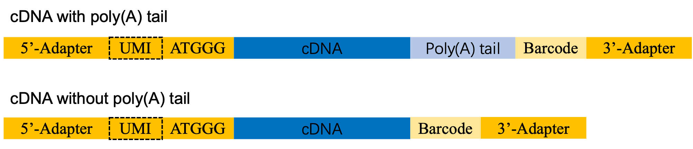
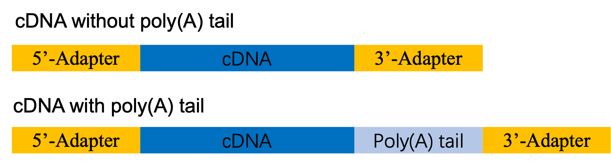

# Scripts used for analyzing PAIso-Seq, PAIso-seq2 and PAIso-seq_ligation data

### Software Dependencies
```
# softwares
ccs (v5.0.0)
bam2fastq (v1.3.0)
pbmerge (v1.0.6)
bwa (0.7.16a-r1181)
minimap2 (2.17-r941)
bedtools (v2.29.2)
samtools (v1.9)
featureCounts (v2.0.0)
fastq-splitter.pl (http://kirill-kryukov.com/study/tools/fastq-splitter)
ParaFly (http://parafly.sourceforge.net/)
```
```
# python packages
re, sys, regex
pysam (https://github.com/pysam-developers/pysam)
parasail (https://github.com/jeffdaily/parasail)
```

### Generate CCS reads from sub reads</br>
**Input:** Subreads from a single movie in PacBio BAM format.</br>
**Output:** Consensus reads in unaligned BAM (.bam) format.</br>

```
# Run on LSF cluster
# Generate commands to run ccs
for i in {1..300}; do printf "bsub -q lowl -n 5 -R \"rusage[mem=20000]\" -J ccs_chunk$i -e err.chunk$i -o log.chunk$i \"  ccs movie.subreads.bam ccs.${i}.bam --chunk ${i}/300 -j 5  \";\n" ; done > bsub_multi.sh

# Submit to cluster
sh bsub_multi.sh

# Merge chunks with pbmerge
pbmerge -o movie.ccs.bam ccs.*.bam


# Run on local computer
ccs movie.subreads.bam movie.ccs.1.bam --chunk 1/10 -j <THREADS>
ccs movie.subreads.bam movie.ccs.2.bam --chunk 2/10 -j <THREADS>
...
ccs movie.subreads.bam movie.ccs.10.bam --chunk 10/10 -j <THREADS>

# Merge chunks with pbmerge and index with pbindex
pbmerge -o movie.ccs.bam movie.ccs.*.bam
pbindex movie.ccs.bam

# Convert bam format to fastq format
bam2fastq -o movie movie.ccs.bam

# Extract the pass number of each CCS reads
GetCCSpass.pl movie.ccs.bam > movie.ccs.pass.txt
```

### Process of PAIso-seq data
**Library structure of PAIso-seq:**</br>
<div align=middle></div>

**5'-adapter** (30 nt): 5'-AAGCAGTGGTATCAACGCAGAGTACATGGG-3'.</br>
**3'-adapter** (25 nt): 5'-GTACTCTGCGTTGATACCACTGCTT-3'.</br>
**Barcode**: the barcode of different samples (16 nt).
#### Step1. Demultiplex and remove adapters 
```
bash ./PAIso-seq/split.sh sample_name
```
#### Step2. Align ccs reads to reference genomes and assign CCS reads to genes
```
bash ./PAIso-seq/mapping.sh sample_name
```
#### Step3. Poly(A) calling
```
bash ./PAIso-seq/trim_note_for_nonUMI_samples.sh sample_name
```
### 
#### Step4. Class ccs reads by gene biotype
```
bash ./PAIso-seq/extract_and_filter_for_nonUMI_samples.sh sample_name
```
### 
</br>

### Process of PAIso-seq2 data
**Library structure of PAIso-seq2:**</br>
<div align=middle></div>

**5'-adapter** (30 nt): 5'-AAGCAGTGGTATCAACGCAGAGTACATGGG-3'.</br>
**3'-adapter** (25 nt): 5'-GTACTCTGCGTTGATACCACTGCTT-3'.</br>
**UMI**: Unique Molecular Identifier, 10nt.</br>
**Barcode**: the barcode of different samples (16 nt).</br>
#### Step1. Demultiplex and remove adapters 
```
bash ./PAIso-seq2/split.sh sample_name
```
#### Step2. Align ccs reads to reference genomes and assign CCS reads to genes
```
bash ./PAIso-seq2/mapping.sh sample_name
```
#### Step3. Poly(A) calling
```
bash ./PAIso-seq2/trim_note_for_UMI_samples.sh sample_name
# (optional) bash ./PAIso-seq2/trim_note_for_UMI_samples_human_last_exon.sh sample_name
```
### 
#### Step4. Class ccs reads by gene biotype
```
bash ./PAIso-seq2/extract_and_filter_for_UMI_samples.sh sample_name
```
###
</br>

### Process of PAIso-seq_ligation data
**Library structure of PAIso-seq_ligation**:</br>
<div align=middle></div>

**5'-adapter** (25 nt): 5'-AAGCAGTGGTATCAACGCAGAGTAC-3'.</br>
**3'-adapter** (25 nt): 5'-GTACTCTGCGTTGATACCACTGCTT-3'.
#### Step1. Demultiplex and remove adapters 
```
bash ./PAIso-seq_ligation/split.sh sample_name
```
#### Step2. Align ccs reads to reference genomes and assign CCS reads to genes
```
bash ./PAIso-seq_ligation/mapping.sh sample_name
```
#### Step3. Poly(A) calling
```
bash ./PAIso-seq_ligation/trim_note_for_nonUMI_samples.sh sample_name
```
### 
#### Step4. Class ccs reads by gene biotype
```
bash ./PAIso-seq_ligation/extract_and_filter_for_nonUMI_samples.sh sample_name
```
### 
</br>

### Process of FLAM-seq data
```
# use CCS_split_clean_UMI_FLAM-seq_V2.py instead of 
```
### 
</br>
